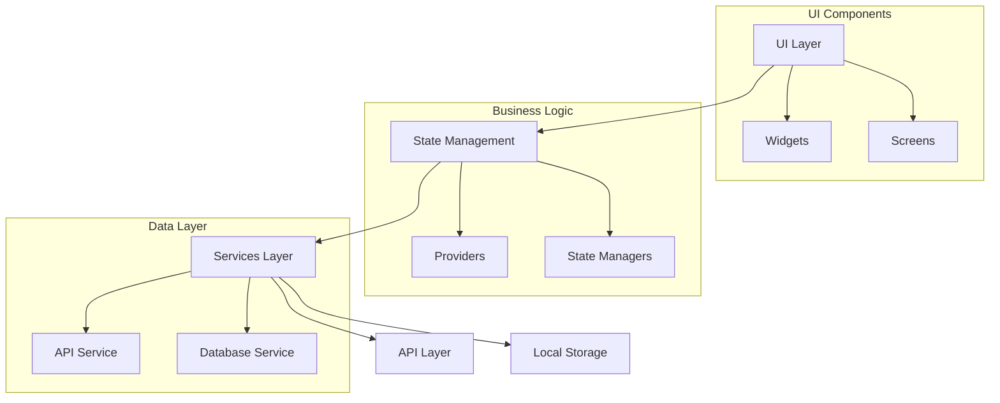

# Vogu Health - Project Documentation

## Table of Contents
1. [Introduction](#introduction)
2. [Project Overview](#project-overview)
3. [Technical Architecture](#technical-architecture)
4. [Core Features](#core-features)
5. [Implementation Details](#implementation-details)
6. [Data Models](#data-models)
7. [API Integration](#api-integration)
8. [State Management](#state-management)
9. [UI Components](#ui-components)
10. [Testing and Quality Assurance](#testing-and-quality-assurance)

## Introduction

Vogu Health is a Flutter-based mobile application designed to help users track and manage their health metrics. The app provides a comprehensive platform for monitoring various health parameters including sleep quality, heart rate, and weight, while offering valuable insights and correlations between different health metrics.

### What is Flutter?
Flutter is a UI framework that allows developers to build natively compiled applications for mobile, web, and desktop from a single codebase. In Vogu Health, we use Flutter to create a consistent user experience across different platforms.

### Key Flutter Concepts Used in Vogu Health
1. **Widgets**: Everything in Flutter is a widget - from buttons to entire screens
2. **State Management**: How data flows through the app
3. **Material Design**: Google's design system for creating beautiful, consistent UIs

## Project Overview

The application is built using Flutter, a cross-platform framework that allows for the development of native applications for both iOS and Android from a single codebase. The project follows a modular architecture pattern, making it maintainable, scalable, and easy to test.

### Key Features
- Health data tracking (sleep, heart rate, weight)
- Data visualization and insights
- Correlation analysis between different health metrics
- Daily health summaries
- Historical data analysis

## Technical Architecture

The project follows a clean architecture pattern with the following directory structure:

```
lib/
├── core/           # Core functionality and utilities
├── data/           # Data layer implementations
├── database/       # Local database operations
├── models/         # Data models and entities
├── presentation/   # UI components and screens
├── providers/      # State management providers
├── screens/        # Application screens
├── services/       # API and other services
├── utils/          # Utility functions
└── widgets/        # Reusable UI components
```

### Architecture Diagram


## Core Features

### 1. Health Data Tracking

The app allows users to track three main health metrics. Each metric follows a similar pattern of data collection, validation, and storage.

#### Sleep Tracking
```dart
// Basic Concept: Data Model
class SleepDataRequest {
  final double quality;  // 0-100 scale
  final DateTime timestamp;
  final String? notes;

  SleepDataRequest({
    required this.quality,
    required this.timestamp,
    this.notes,
  });

  Map<String, dynamic> toJson() => {
    'quality': quality,
    'timestamp': timestamp.toIso8601String(),
    'notes': notes,
  };
}

// Implementation: API Service
Future<ApiResponse> submitSleepData(SleepDataRequest request) async {
  if (request.quality < 0 || request.quality > 100) {
    throw ValidationException(
      'Invalid sleep quality',
      errors: {'quality': 'Must be between 0 and 100'},
    );
  }

  return _makeRequest<ApiResponse>(
    endpoint: '/api/v1/health-data/sleep',
    method: 'POST',
    body: request.toJson(),
    fromJson: (json) => ApiResponse.fromJson(json),
  );
}

// Implementation: UI Component
class SleepDataInputForm extends StatefulWidget {
  @override
  _SleepDataInputFormState createState() => _SleepDataInputFormState();
}

class _SleepDataInputFormState extends State<SleepDataInputForm> {
  final _formKey = GlobalKey<FormState>();
  double _quality = 0.0;
  String? _notes;

  @override
  Widget build(BuildContext context) {
    return Form(
      key: _formKey,
      child: Column(
        children: [
          Slider(
            value: _quality,
            min: 0,
            max: 100,
            divisions: 100,
            label: _quality.round().toString(),
            onChanged: (value) => setState(() => _quality = value),
          ),
          TextFormField(
            decoration: InputDecoration(labelText: 'Notes'),
            onChanged: (value) => _notes = value,
          ),
          ElevatedButton(
            onPressed: _submitData,
            child: Text('Submit'),
          ),
        ],
      ),
    );
  }
}
```

#### Heart Rate Monitoring
```dart
// Basic Concept: Data Model
class HeartRateDataRequest {
  final int value;  // 40-200 bpm
  final DateTime timestamp;
  final String? activity;

  HeartRateDataRequest({
    required this.value,
    required this.timestamp,
    this.activity,
  });

  Map<String, dynamic> toJson() => {
    'value': value,
    'timestamp': timestamp.toIso8601String(),
    'activity': activity,
  };
}

// Implementation: API Service
Future<ApiResponse> submitHeartRateData(HeartRateDataRequest request) async {
  if (request.value < 40 || request.value > 200) {
    throw ValidationException(
      'Invalid heart rate',
      errors: {'value': 'Must be between 40 and 200'},
    );
  }

  return _makeRequest<ApiResponse>(
    endpoint: '/api/v1/health-data/heart-rate',
    method: 'POST',
    body: request.toJson(),
    fromJson: (json) => ApiResponse.fromJson(json),
  );
}
```

#### Weight Tracking
```dart
Future<ApiResponse> submitWeightData(WeightDataRequest request) async {
  if (request.value < 20 || request.value > 300) {
    throw ValidationException(
      'Invalid weight',
      errors: {'value': 'Must be between 20 and 300 kg'},
    );
  }

  return _makeRequest<ApiResponse>(
    endpoint: '/api/v1/health-data/weight',
    method: 'POST',
    body: request.toJson(),
    fromJson: (json) => ApiResponse.fromJson(json),
  );
}
```

### 2. Data Retrieval and Analysis

The app provides comprehensive data retrieval capabilities:

```dart
Future<List<SleepDataResponse>> getSleepData({int days = 7}) async {
  if (days < 1 || days > 30) {
    throw ValidationException(
      'Invalid days parameter',
      errors: {'days': 'Must be between 1 and 30'},
    );
  }

  return _makeRequest<List<SleepDataResponse>>(
    endpoint: '/api/v1/health-data/sleep?days=$days',
    method: 'GET',
    fromJson: (json) => // ... data processing
  );
}
```

### 3. Health Insights

The app provides various types of insights:

- Sleep insights
- Heart rate insights
- Weight insights
- Correlation insights between different metrics

## Data Models

The application uses several data models to represent different aspects of health data:

### API Models
- `SleepDataRequest/Response`
- `HeartRateDataRequest/Response`
- `WeightDataRequest/Response`
- `DailyHealthSummaryResponse`

### Insight Models
- `SleepInsightResponse`
- `HeartRateInsightResponse`
- `WeightInsightResponse`
- `CorrelationInsightResponse`

## API Integration

### Basic Concept
API integration involves making HTTP requests to a server to fetch or send data. Vogu Health uses a service-based approach to handle API communications.

### Implementation
```dart
// Basic Concept: API Service
class HealthApiService {
  final String baseUrl;
  final http.Client _client;

  HealthApiService({
    this.baseUrl = 'https://olive-clubs-care.loca.lt',
    http.Client? client,
  }) : _client = client ?? http.Client();

  // Generic request method
  Future<T> _makeRequest<T>({
    required String endpoint,
    required String method,
    Map<String, dynamic>? body,
    T Function(Map<String, dynamic> json)? fromJson,
  }) async {
    try {
      final uri = Uri.parse('$baseUrl$endpoint');
      final headers = {
        'Content-Type': 'application/json',
        'Accept': 'application/json',
      };

      final response = await _client.send(
        http.Request(method, uri)
          ..headers.addAll(headers)
          ..body = body != null ? jsonEncode(body) : '',
      );

      final responseBody = await response.stream.bytesToString();
      final json = jsonDecode(responseBody);

      if (response.statusCode >= 200 && response.statusCode < 300) {
        if (fromJson != null) {
          return fromJson(json);
        }
        return json as T;
      }

      throw ApiException(
        json['message'] ?? 'Unknown error occurred',
        statusCode: response.statusCode,
        data: json,
      );
    } catch (e) {
      if (e is ApiException) rethrow;
      throw NetworkException('Failed to make request: $e');
    }
  }
}

// Implementation: Usage Example
class HealthDataRepository {
  final HealthApiService _apiService;

  HealthDataRepository(this._apiService);

  Future<List<HealthDataPoint>> getHealthData() async {
    return _apiService._makeRequest<List<HealthDataPoint>>(
      endpoint: '/api/v1/health-data',
      method: 'GET',
      fromJson: (json) => (json['data'] as List)
          .map((item) => HealthDataPoint.fromJson(item))
          .toList(),
    );
  }
}
```

## State Management

### Basic Concept
State management in Flutter is about managing the data that can change over time in your app. Vogu Health uses the Provider pattern for state management.

### Implementation
```dart
// Basic Concept: State Manager
class HealthDataStateManager extends ChangeNotifier {
  List<HealthDataPoint> _dataPoints = [];
  bool _isLoading = false;
  String? _error;

  List<HealthDataPoint> get dataPoints => _dataPoints;
  bool get isLoading => _isLoading;
  String? get error => _error;

  Future<void> fetchData() async {
    _isLoading = true;
    notifyListeners();

    try {
      _dataPoints = await _apiService.getHealthData();
      _error = null;
    } catch (e) {
      _error = e.toString();
    } finally {
      _isLoading = false;
      notifyListeners();
    }
  }
}

// Implementation: Provider Setup
class MyApp extends StatelessWidget {
  @override
  Widget build(BuildContext context) {
    return MultiProvider(
      providers: [
        ChangeNotifierProvider(
          create: (_) => HealthDataStateManager(),
        ),
      ],
      child: MaterialApp(
        home: HealthDataScreen(),
      ),
    );
  }
}

// Implementation: Usage in Widget
class HealthDataWidget extends StatelessWidget {
  @override
  Widget build(BuildContext context) {
    return Consumer<HealthDataStateManager>(
      builder: (context, stateManager, child) {
        if (stateManager.isLoading) {
          return CircularProgressIndicator();
        }
        
        if (stateManager.error != null) {
          return Text('Error: ${stateManager.error}');
        }
        
        return ListView.builder(
          itemCount: stateManager.dataPoints.length,
          itemBuilder: (context, index) {
            final point = stateManager.dataPoints[index];
            return ListTile(
              title: Text('${point.value}'),
              subtitle: Text(point.timestamp.toString()),
            );
          },
        );
      },
    );
  }
}
```

## UI Components

The app uses Material Design 3 and provides a modern, intuitive user interface. Key UI components include:

- Health data input forms
- Data visualization charts
- Insight cards
- Navigation tabs
- Summary views

## Testing and Quality Assurance

### Basic Concept
Testing in Flutter involves verifying that your app works as expected. This includes unit tests, widget tests, and integration tests.

### Implementation
```dart
// Basic Concept: Unit Test
void main() {
  group('HealthApiService', () {
    late HealthApiService apiService;
    late MockClient mockClient;

    setUp(() {
      mockClient = MockClient();
      apiService = HealthApiService(client: mockClient);
    });

    test('submitSleepData returns success response', () async {
      // Arrange
      final request = SleepDataRequest(
        quality: 85,
        timestamp: DateTime.now(),
      );

      when(mockClient.send(any)).thenAnswer((_) async => 
        http.StreamedResponse(
          Stream.value(utf8.encode('{"status": "success"}')),
          200,
        ));

      // Act
      final response = await apiService.submitSleepData(request);

      // Assert
      expect(response.status, equals('success'));
    });
  });
}

// Implementation: Widget Test
void main() {
  testWidgets('SleepDataInputForm submits data correctly', 
    (WidgetTester tester) async {
    // Arrange
    await tester.pumpWidget(
      MaterialApp(
        home: SleepDataInputForm(),
      ),
    );

    // Act
    await tester.enterText(
      find.byType(TextFormField),
      'Good sleep',
    );
    await tester.tap(find.byType(ElevatedButton));
    await tester.pump();

    // Assert
    expect(find.text('Data submitted successfully'), findsOneWidget);
  });
}
```

## Getting Started

To start using the application:

1. Clone the repository
2. Install dependencies:
   ```bash
   flutter pub get
   ```
3. Run the app:
   ```bash
   flutter run
   ```

## Best Practices

The project follows several best practices:

1. **Error Handling**: Comprehensive error handling for API calls and data validation
2. **Type Safety**: Strong typing throughout the application
3. **Code Organization**: Clean architecture with clear separation of concerns
4. **Documentation**: Well-documented code with clear comments
5. **Testing**: Built-in support for unit and widget testing

## Future Enhancements

Potential areas for future development:

1. Additional health metrics
2. Enhanced data visualization
3. Machine learning-based insights
4. Social features
5. Integration with wearable devices

## Conclusion

Vogu Health is a comprehensive health tracking application that provides users with tools to monitor and improve their health. The application's modular architecture and clean code structure make it maintainable and extensible for future enhancements. 